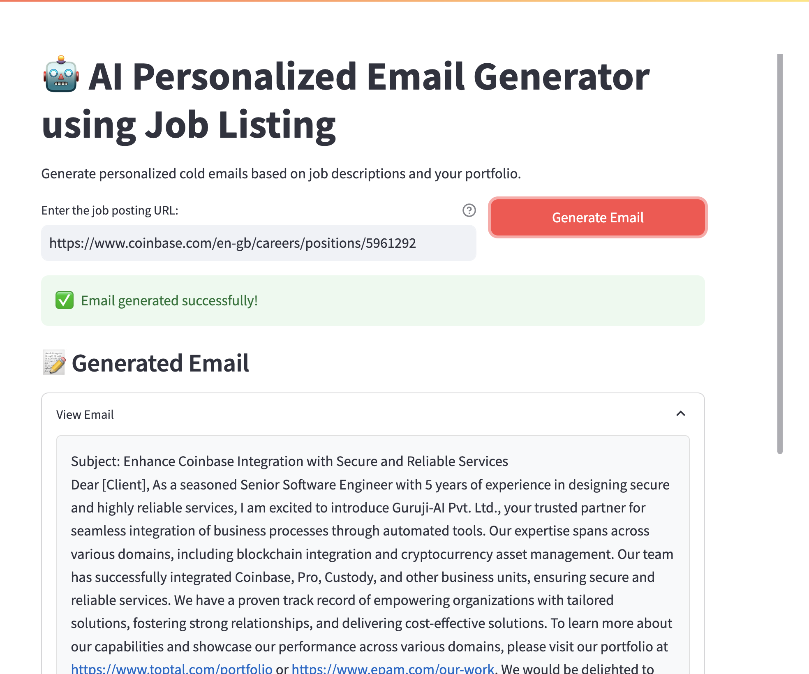

# LlamaMail: AI-Powered Job Application Assistant

## 📌 Overview

The AI Cold Email Generator is an innovative tool designed to streamline the process of creating personalized cold emails for job applications. By leveraging AI technology, this application analyzes job postings and generates tailored emails that highlight relevant skills and experiences.



## 🎥 Demo

Check out our demo video to see the AI Cold Job Email Generator in action:

[Watch the Demo Video](demo/Demo_Llama3.2_Job_Email_Generator.mov)

## ✨ Features

- **Job Analysis**: Automatically extracts key information from job postings.
- **Skill Matching**: Identifies relevant skills from your portfolio.
- **Personalized Email Generation**: Creates customized cold emails based on the job requirements and your skills.
- **User-Friendly Interface**: Easy-to-use Streamlit-based web application.

## 🛠 Installation

1. Clone the repository:
   ```
   git clone https://github.com/your-username/Llama3-LLM-Target-Potenial-Clients
   cd Llama3-LLM-Target-Potenial-Clients
   ```

2. Create and activate a virtual environment:
   ```
   python -m venv .venv
   source .venv/bin/activate  # On Windows, use `.venv\Scripts\activate`
   ```

3. Install the required packages:
   ```
   pip install -r requirements.txt
   ```

4. Set up your environment variables:
   Create a `.env` file in the root directory and add your API keys:
   ```
   GROQ_API_KEY=your_llama_api_key
   ```

## 💻 Usage

1. Start the Streamlit app:
   ```
   streamlit run src/main.py
   ```

2. Open your web browser and navigate to the URL provided by Streamlit (usually `http://localhost:8501`).

3. Enter the URL of a job posting you're interested in.

4. Click "Generate Email" and wait for the AI to analyze the job and create your personalized cold email.

5. Review the generated email, job analysis, and relevant portfolio links.

6. Copy the email content and use it as a starting point for your job application.

## 📁 Project Structure

```
Llama3-LLM-Target-Potenial-Clients/
├── src/
│   ├── main.py
│   ├── chains.py
│   ├── portfolio.py
│   └── utils.py
├── data/
│   └── tech_stack_sample.csv
├── demo/
│   ├── demo_screenshot.png
│   └── AI_Cold_Email_Generator_Demo.mp4
├── .gitignore
├── requirements.txt
└── README.md
```

## 🤝 Contributing

Contributions, issues, and feature requests are welcome! Feel free to check [issues page](https://github.com/thekhananas/) if you want to contribute.

## 📝 License

This project is [MIT](https://choosealicense.com/licenses/mit/) licensed.

## 🙏 Acknowledgements

- Llama (Meta AI) and Groq for providing the language model API
- LangChain for allowing to chain different agents
- Streamlit for the excellent web app framework
- All contributors and supporters of this project
